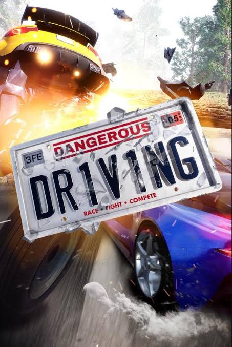

## What makes driving dangerous?

::: columns 
::: {.column width = "50%"}

- Drivers get distracted (phone, radio, passengers)
- Driving too fast
- Drunk driving
- Sleep deprivation

:::

:::{.column width = "50%"}
<center>

</center>

:::
:::
## The numbers do not lie


Many people die from car accidents each year...


```{r}
#| echo: False

library(astsa)
data("Seatbelts")

library(dygraphs)
dygraph(Seatbelts[,1], main = "Number of Drivers Killed per Year", ylab = "Drivers Killed")

```


## A Closer Look at the Data


```{r}
library(DT)
Seatbelts |> 
  datatable(options = list(pageLength = 20))
```


## Seatbelts

To make driving safer seatbelts were invented.

But people decided not wear them so, 

governments started seatbelt campaigns: 




## But do they work?

:::columns
:::{.column width = "50%"}

<center>
Code for the simplest test: 

```{r}
#| eval: False

t.test(DriversKilled ~ law, data = Seatbelts)
```

</center>
:::
:::{.column width = "50%"}
<center>
Test results: 

```{r}
#| output: asis
#| cache: True
#| code-line-numbers: True
#| code-fold: True
t.test(DriversKilled ~ law, data = Seatbelts)
```

</center>

:::
:::

## Renv 

```{r}
library(renv)

renv::init()

sessionInfo()
```
Created on 30-09-2026 with the renv package @ushey_renv_2019


